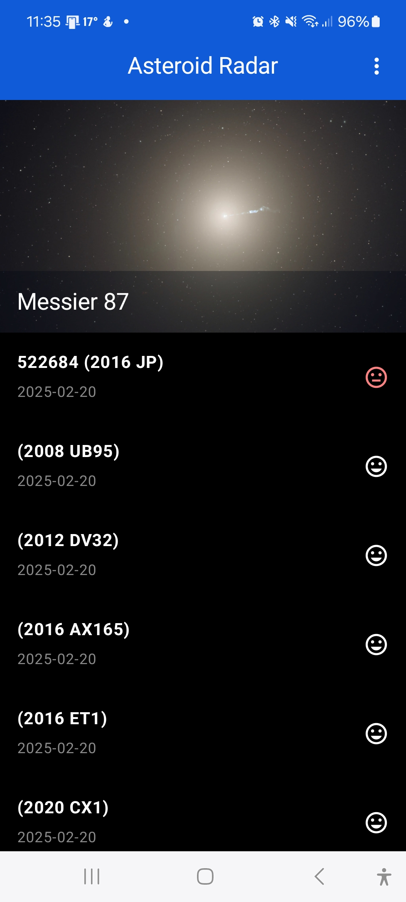
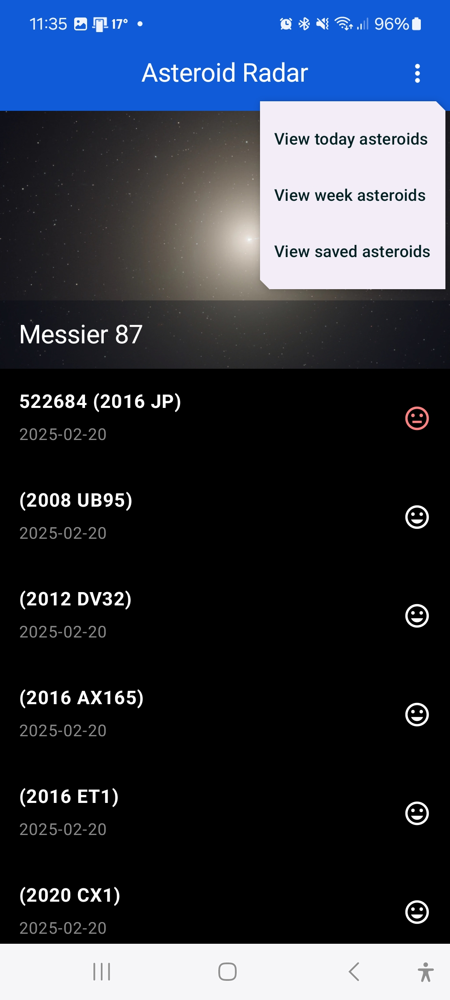
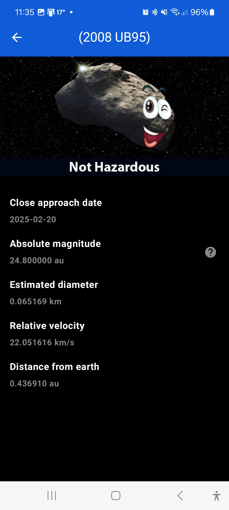
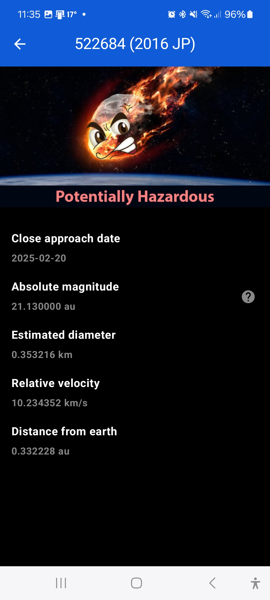
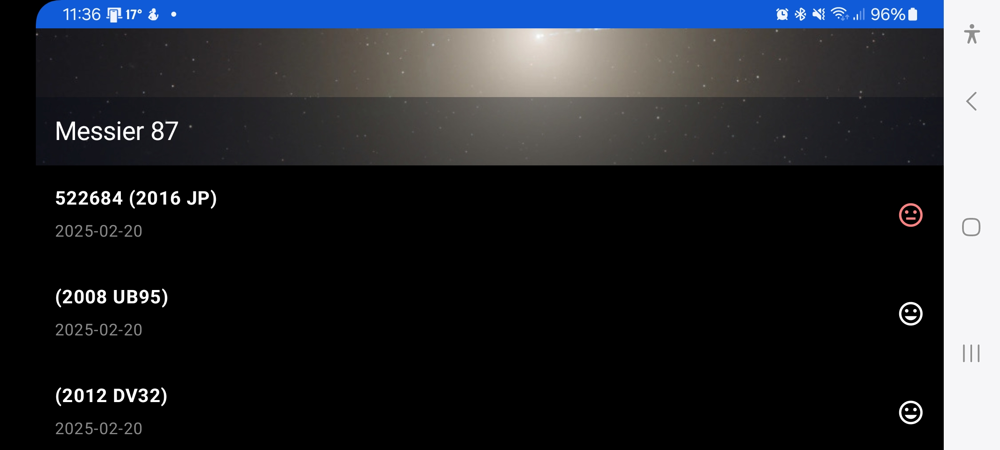

# AsteroidRadar  

**"A NASA-powered app to monitor asteroids and their Earth proximity, with offline features and clean architecture."**

AsteroidRadar is an app designed to help users trace asteroids detected by NASA that pass near Earth, using a free, open-source API provided by the NASA JPL Asteroid team. The app also stores data locally for offline access. This project is the second in the **Udacity Android Kotlin Developer Nanodegree Program**.

## Main Features of the Project  

- **MVVM Architecture**: Implements a Repository pattern for clean, maintainable architecture.
- **Offline Mode**: Supports offline data access using Room for local storage.
- **Paging Library (v3)**: Optimizes data viewing with seamless scrolling.
- **Accessible UI**: ContentDescriptions dynamically generated for accessibility.
- **Orientation Support**: Adapts to portrait and landscape orientations without losing data.
- **Background Data Updates**: Periodic data updates using WorkManager.
- **Modern UI**: Uses single-activity architecture with multiple fragments.
- **Reactive UI**: Incorporates DataBindingAdapter and Kotlin Flow for a reactive user experience.
- **Dependency Injection**: Koin (v4) used for better modularity and testability.

## Project Resources

- [Starter Project Code](https://github.com/udacity/nd940-android-kotlin-c2-starter/tree/master/starter): Get the starter code for the project.
- [Project Rubric](https://docs.google.com/document/d/1zuizdkZE564NyypAysOyI8sX7mICE64eMlmOPUV8W9w/edit?usp=sharing): View the project rubric.
- [Android Kotlin Developer Nanodegree Program](https://www.udacity.com/course/android-kotlin-developer-nanodegree--nd940): Learn more about the full program and its related projects.

## Installation Guide  

This project requires a NASA API Key. Follow these steps to run the app:  

1. **Clone the Repository**: Clone the project repository using Git.
2. **Open in Android Studio**: Open the project in **Android Studio Ladybug (2024.2.1 Patch 2)** or later.
3. **Generate NASA API Key**: Obtain your [NASA API Key](https://api.nasa.gov/).
4. **Add NASA API Key**: Add the NASA API key to the `local.properties` file or follow the [Secrets Gradle Plugin guide](https://developers.google.com/maps/documentation/places/android-sdk/secrets-gradle-plugin).
5. **Build the Project**: Use **Gradle Plugin v8.7.2** to build the project.

**Note:** Ensure you have the latest version of Android Studio and the Gradle build tool installed. Please look at the [official guide](https://developer.android.com/studio/install) if needed.

## Included External Libraries  

- **[Koin (v4)](https://github.com/InsertKoinIO/koin)**: Dependency injection.
- **[Timber](https://github.com/JakeWharton/timber)**: Logging utility.
- **[Picasso](https://github.com/square/picasso)**: Image loading and caching.
- **[Retrofit](https://github.com/square/retrofit)**: REST API management.
- **[Moshi](https://github.com/square/moshi)**: JSON parsing.
- **[Secrets Gradle Plugin](https://developers.google.com/maps/documentation/places/android-sdk/secrets-gradle-plugin)**: Secure management of sensitive data.
- **[KSP](https://developer.android.com/build/migrate-to-ksp)**: Annotation processing.

## Snapshots from the App  

### Phone Screens (Portrait)  

<table>
<tr>
 <td align="center">
   
   
<strong>Asteroid List</strong> Displays a paging list of asteroids with essential information.

 </td>
 <td align="center">
   
   
<strong>Asteroids Filter</strong> Customizable filter to auto-fetch specific data using Repository.

 </td>
</tr>
<tr>
 <td align="center">
   
   
<strong>Asteroid Detail - Non-Hazardous</strong> Dynamic previews details of a non-hazardous asteroid.

 </td>
 <td align="center">
   
   
<strong>Asteroid Detail - Hazardous</strong> Dynamic previews details of a hazardous asteroid.

 </td>
</tr>
</table>

  

### Phone Screens (Landscape)  

<strong>Asteroid List in Landscape Mode</strong> Optimized for a seamless landscape viewing experience.

  

## Contributing

Contributions are welcome! Please open an issue or submit a pull request for improvements or bug fixes.

## Contact

If you have any questions or need support, you can contact me through the issues section or directly contribute to enhancing the project.

## License  

This project is open-source and licensed under the Apache 2.0 License.  
For more details, see the LICENSE file in this repository.
